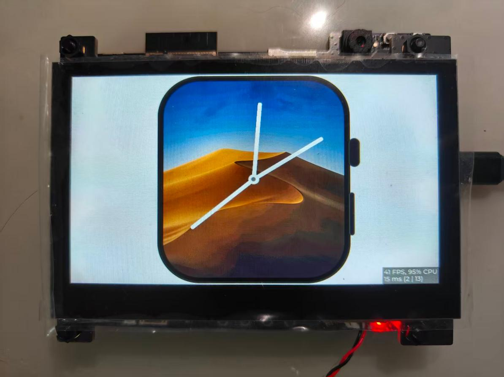

# esp_elenixos

[English](./README.md) | 中文

`esp_elenixos` 是 ElenixOS 的 ESP-IDF 移植工程，用于在 ESP32-S31 Korvo1 目标板上运行 ElenixOS 智能手表界面。

ElenixOS 是一款开源的智能手表操作系统，基于 LVGL 构建图形界面，表盘和应用程序运行在 JerryScript 驱动的脚本运行环境中。它面向资源受限的嵌入式设备，强调可移植、可扩展，并提供接近智能手表的手势、动画和应用体验。

## 在线体验

无需准备硬件，可以直接通过浏览器体验 ElenixOS 在线模拟器：

[https://simulator.elenixos.com/wasm/latest/main.html](https://simulator.elenixos.com/wasm/latest/main.html)

## 演示图片



## 工程说明

- ESP-IDF 工程入口在 `CMakeLists.txt`。
- 主程序在 `main/main.c`，负责初始化板级外设、LCD、触摸、LVGL adapter，并启动 ElenixOS。
- ElenixOS 本体和 ESP 移植层位于 `components/elenixos/`。
- LVGL 组件位于 `components/lvgl/`。
- `fs/` 会在构建时打包为 `storage` FAT 分区镜像，并挂载为 ElenixOS 的 `/flash` 系统根目录。
- 当前默认目标为 `esp32s31`，板级配置为 `esp32_s31_korvo1`。

## 构建和烧录

请先进入 ESP-IDF 环境：

```sh
. $IDF_PATH/export.sh
```

然后在本目录执行：

```sh
pip install esp-bmgr-assist
idf.py bmgr -b esp32_s31_korvo1
idf.py set-target esp32s31
idf.py build
idf.py -p /dev/ttyUSB0 flash monitor
```

如果串口设备不同，请把 `/dev/ttyUSB0` 替换为实际设备名。

## 相关链接

- ElenixOS 文档: https://docs.elenixos.com
- ElenixOS 仓库: https://github.com/ElenixOS/ElenixOS
- LVGL: https://lvgl.io
